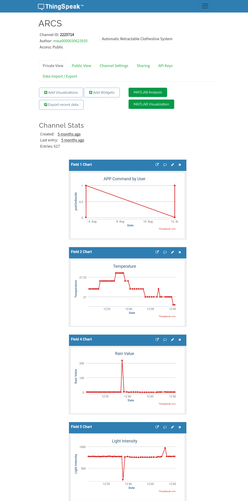
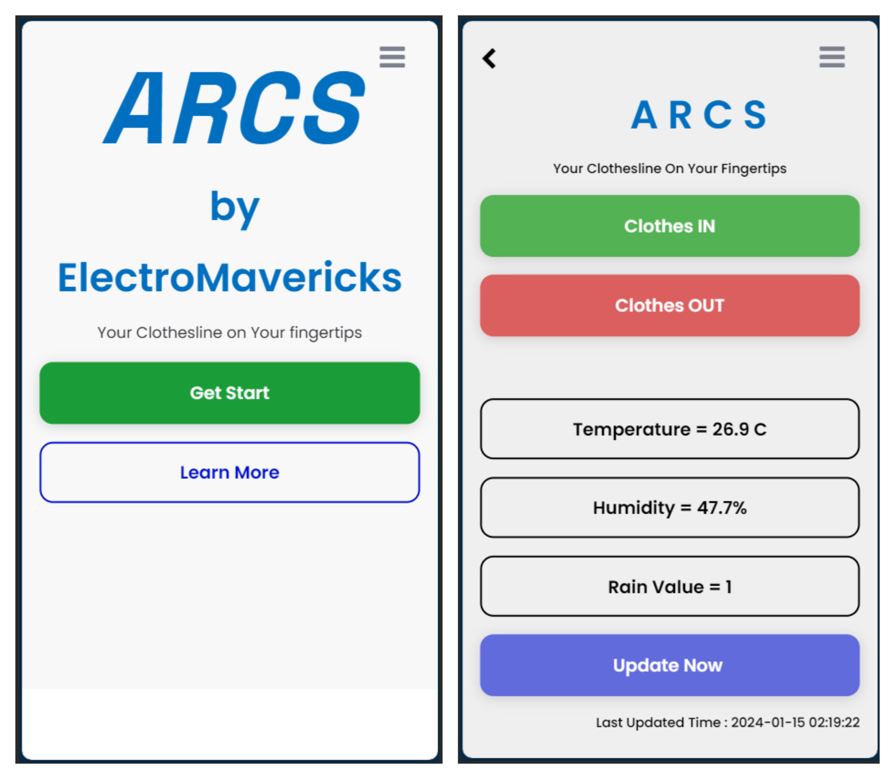
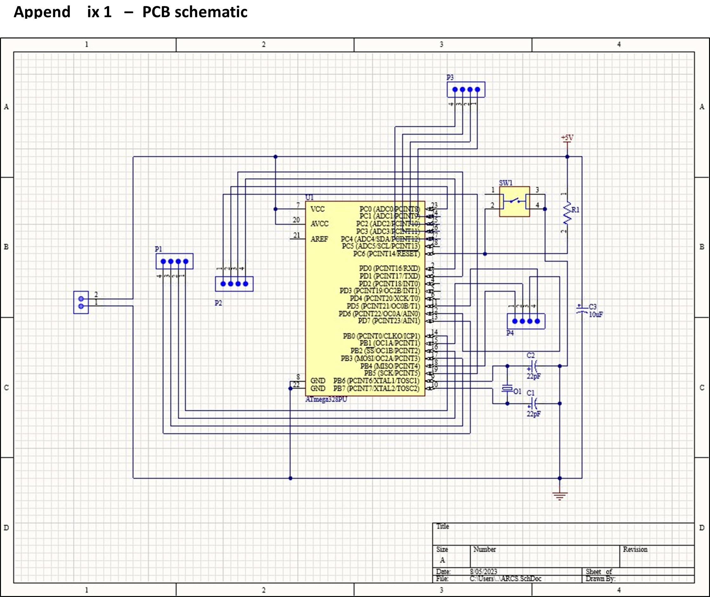
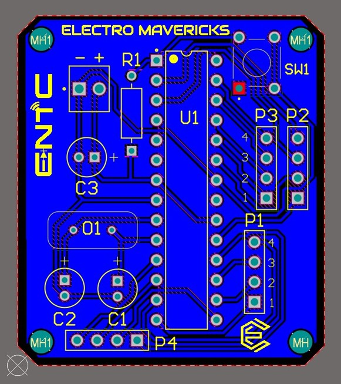
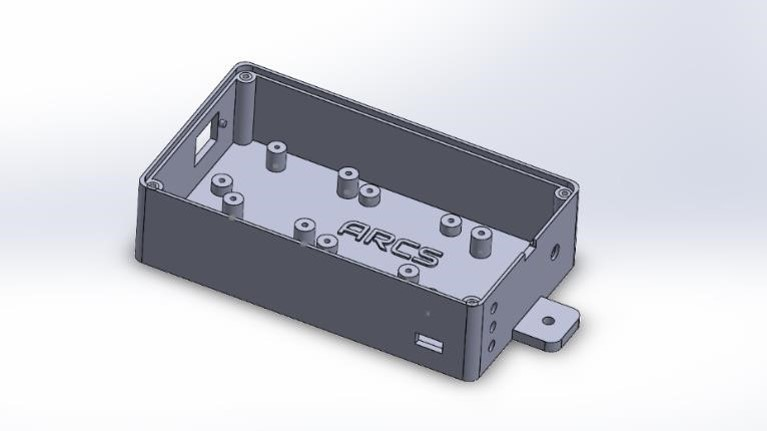
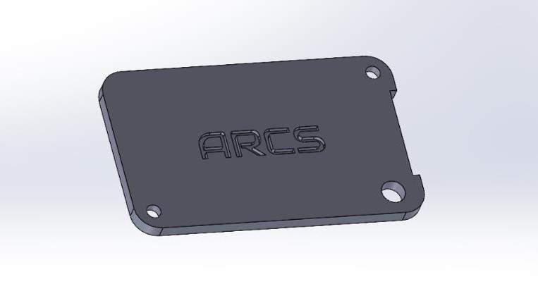
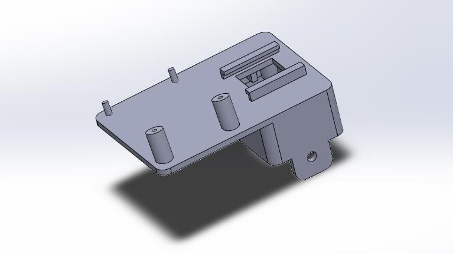

# Automatic Retractable Clothesline System (ARCS) 🌐🧺

## Introduction

The Automatic Retractable Clothesline System (ARCS) is an Arduino-based project designed to simplify the process of drying clothes outdoors. By incorporating various sensors and a stepper motor, the system can automatically retract the clothesline in response to rain or adverse weather conditions.

## Features

- **Automated Rain Detection:** Equipped with a rain sensor, the system retracts the clothesline when rain or moisture is detected, protecting the clothes from getting wet.
- **Humidity and Temperature Monitoring:** Utilizes a DHT (Digital Humidity and Temperature) sensor to monitor ambient humidity and temperature, helping users determine the optimal time for clothes drying.
- **Light Intensity Sensing:** An LDR (Light Dependent Resistor) measures ambient light intensity. The system considers this data when deciding whether to retract the clothesline, accounting for low light conditions even if rain is detected.
- **Stepper Motor Control:** Employs a stepper motor to control the movement of the clothesline. It rotates to retract the line during adverse conditions and reverses the rotation to extend it when conditions improve.
- **Remote Monitoring with Thingspeak Integration:** Integrated with the Thingspeak platform, allowing users to remotely monitor the system's status. Real-time data, including temperature, humidity, and rain status, can be viewed through the Thingspeak web interface or mobile app.

## Installation

1. **Mount the sensors:** Position the rain sensor, DHT sensor, and LDR at suitable locations for accurate readings.
2. **Connect the Arduino board:** Follow the provided pin definitions in the code to connect the Arduino board to the sensors and the stepper motor.
3. **Upload Arduino code:** Upload the provided Arduino code to enable automated functionality.
4. **Power on the system:** Ensure the system is connected to a Wi-Fi network for Thingspeak integration.

## Usage

1. Hang clothes on the clothesline as usual.
2. The system will autonomously retract the line during unfavorable weather conditions.

## Remote Monitoring and Control

### Thingspeak Visualization

- Access real-time data, including temperature, humidity, and rain status

Check out the real-time data visualization of your ARCS system on Thingspeak. Visit [Thingspeak](https://thingspeak.com/channels/2225714) for detailed analytics and monitoring.

### Mobile App for Remote Control

ARCS comes with a dedicated mobile app that allows you to control and monitor your Automatic Retractable Clothesline System from anywhere. The mobile app is available on [Android](#) platform.

#### Features:

- **Remote Control:** Start, stop, or customize the drying process remotely.
- **Real-time Monitoring:** Monitor the status of your clothesline system, including temperature, humidity, and rain detection.
- **Notification Alerts:** Receive instant alerts on your mobile device for important events such as rain detection or system malfunctions.

#### Installation:

 -**Android:** Download the app from [Releases Section](../../releases/tag/v1.0.0).

#### Usage:

1. Launch the ARCS mobile app on your device.
2. Log in using your ARCS system credentials.
3. Enjoy convenient remote control and monitoring of your clothesline system.

## Team Members - ElectroMavericks Team

This project is proudly developed by the ElectroMavericks Team:

- [**Prabodha K.P.K.A**](https://github.com/AkhilaPrabodha)
- [**Vidmal H.V.P**](https://github.com/pulinduvidmal)
- [**Nayanthara J.N.P**](https://github.com/Navini11)
- [**Surendra S.A.J.E**](https://github.com/eshansurendra)

## More Information

Visit our [ElectroMavericks Systems](https://www.electromavericks.systems/) website for more details about the Automatic Retractable Clothesline System (ARCS).

### PCB Design

#### Schematic Diagram

#### PCB Layout

#### PCB 3D View

### Enclosure Design

#### Enclosure

#### Sensor Panel

.jpg)

